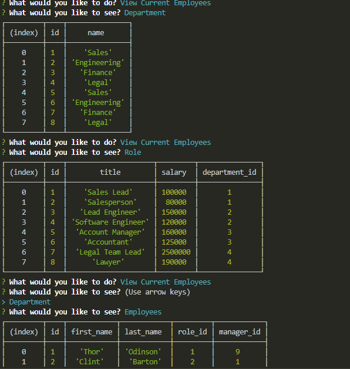

# Employee_Management_System_HW

As an Employeer, 
sometime it is hard to know abll the information about a given company.
Therefore, I created a way to view all given information from the company database at any given time.

This is the employee management system assignment. Users will be able to view an entire databse of departments, role and current employees. In order to use this, users will first need to use 2 nom oacajages, inquirer and mysql. Afterwards they will need to create the database on their local drive via the scheema,sql file provides. Users will then be able to view current database, be able to add and remove employees and update employee informaiton should they chose

# View Current Database

